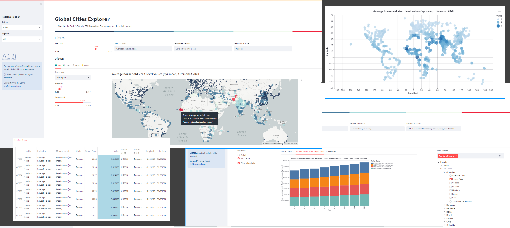

# Streamlit-Projects

Streamlit projects available in this repo:

* An introduction to Streamlit presented at DS-OX (Feb 26, 2020) meetup

	[Streamlit 101 - Jaribu](./JaribuPresentation)

* A home-grown template you can use to kick off your own Streamlit projects, with full instructions included 

	[My App Template](./MyAppTemplate)

* Text summarization using Gensim, Sumy and custom Tf-Idf algorithms

	[Text Summarization Experiments](./TextSummarization)

* A proof-of-concept app with rich dashboard-like visualisation to explore a small set of Global Cities forecasts variables

	[Global Cities](./GlobalCities)

---
## Data used in these applications

The sample data used in these applications is either obtained from public sources or the property of Oxford Economics Ltd. (OE). Data owned by OE is provided for personal use and educational purposes only. OE forecast data is normally restricted to OE clients (or pay-walled) so may have been transformed in such a way that it is still representative of original level values, and suitable for the purposes of these applications. Please do not redistribute this data without the express permission of the owner, Oxford Economics.

---
## Author disclaimer

The views expressed, thoughts, opinions, and presentation of facts in this repository reflect only my views and not the wider views of my employer.

---
## Apache License, Version 2.0

Copyright 2020 Oxford Economics Ltd.

Licensed under the Apache License, Version 2.0 (the "License");
you may not use this file except in compliance with the License.
You may obtain a copy of the License at

     http://www.apache.org/licenses/LICENSE-2.0

Unless required by applicable law or agreed to in writing, software
distributed under the License is distributed on an "AS IS" BASIS,
WITHOUT WARRANTIES OR CONDITIONS OF ANY KIND, either express or implied.
See the License for the specific language governing permissions and
limitations under the License.