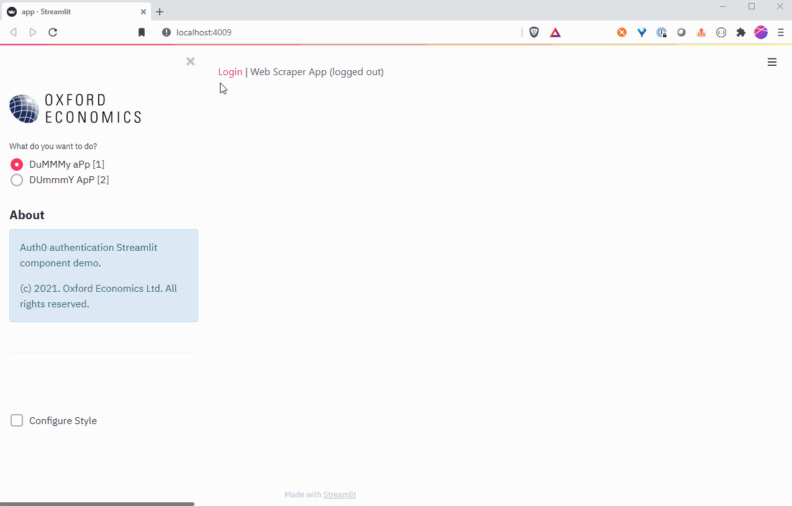
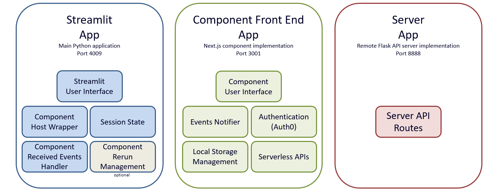
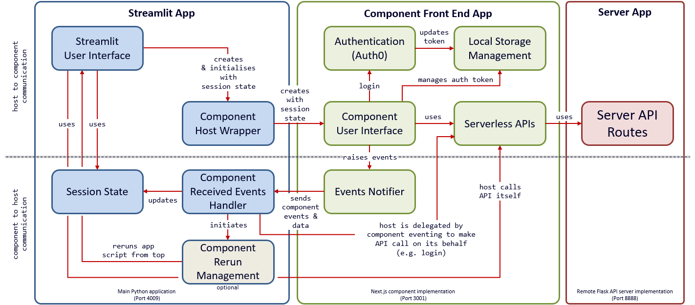
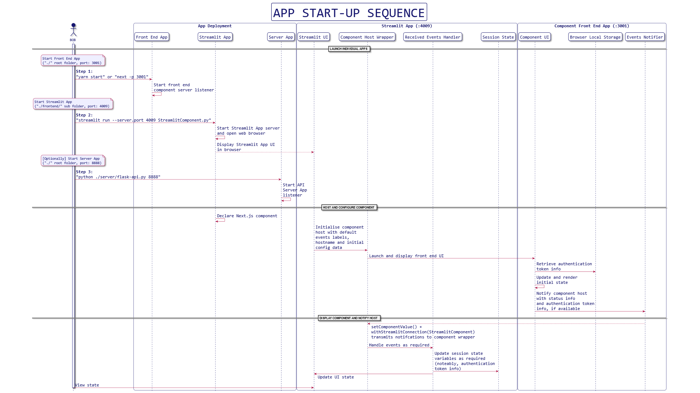
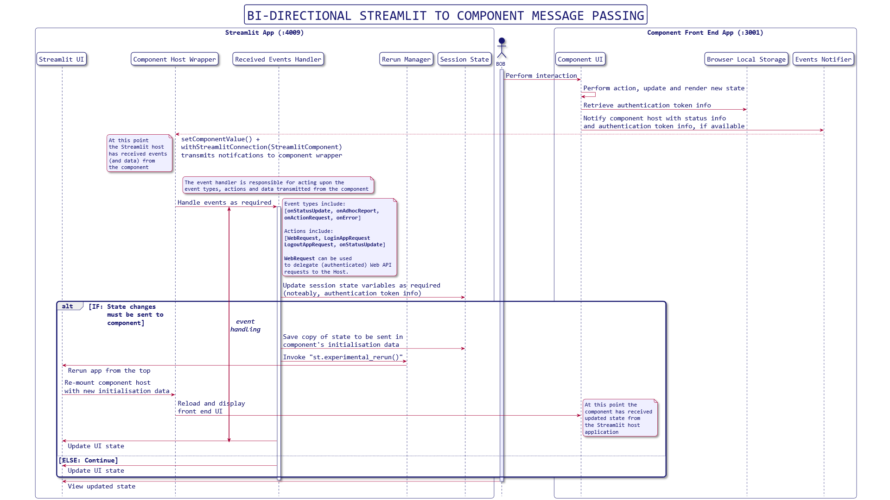
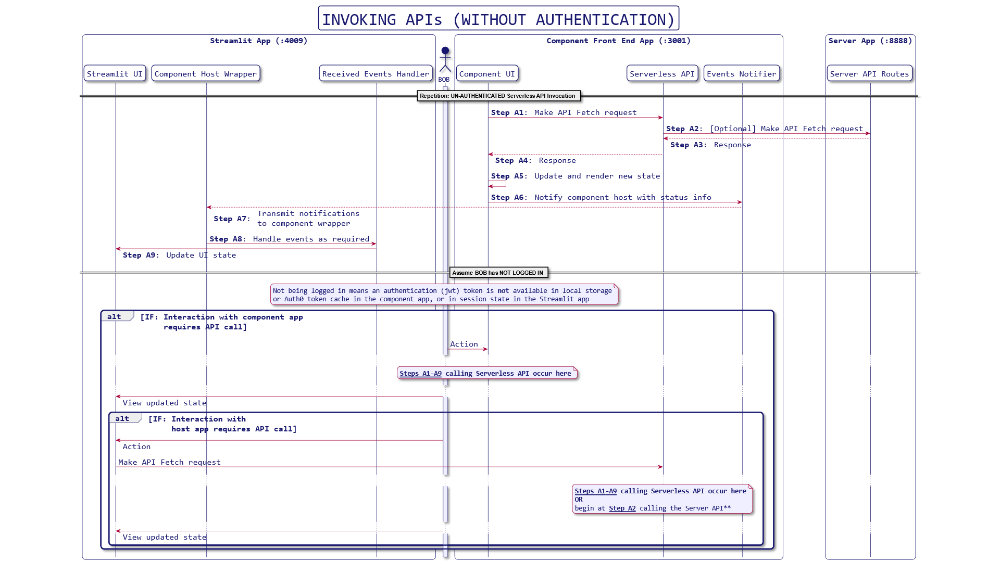
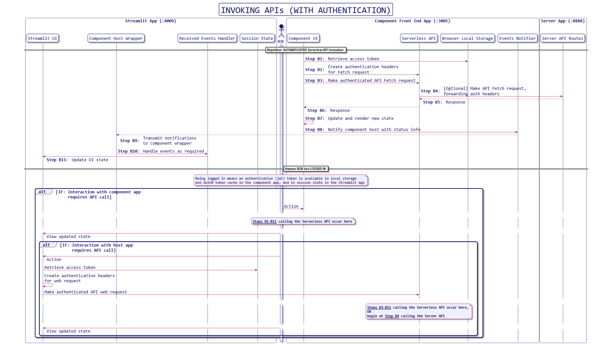

# Streamlit Next.js Component, Auth0 Authentication, Event-Based Messaging & Serverless APIs

> Arvindra Sehmi, Oxford Economics Ltd. | [Website](https://www.oxfordeconomics.com/) | [LinkedIn](https://www.linkedin.com/in/asehmi/)
> (Updated: 5 March, 2021)

Let me put it out there, I'm a big, big fan of [Streamlit](https://www.streamlit.io/) and use it a lot at work and play. Thank you Team Streamlit!

I've got to a point now where I need to secure/authenticate the apps I want to build and support different kinds of communication patterns between a Streamlit host application, embedded components, and call both public and protected APIs, whilst keeping the number of moving parts and different technologies used to a minimum. A challenge worth pursuing to retain the productivity raison d'etre of Streamlit - "The fastest way to build and share data apps".

## Application structure

There are three parts to my solution:

1. __Streamlit component host app__ (localhost, port 4009)
2. __Next.js (React) component__ (localhost, port 3001)
3. __Flask server hosting API endpoint__ (localhost, port 8888)

## [1] Streamlit component host app

This uses a component design similar to [@synode's](https://discuss.streamlit.io/u/synode/summary) [Streamlit-Player](https://discuss.streamlit.io/t/streamlit-player/3169) and generalises its ability to receive `OnStatusUpdate` and `OnError` _events_ from the hosted component, so it can be used more easily as a component template in other applications. The generalisation includes an example of handling a "delegated host action" `OnActionRequest` event. `auth0_login_component` component provided is able to handle `OnActionRequest` where the component can request the host (i.e. the Streamlit app) to make a web request.

Results from the host's web request (or other actions) can be _passed_ back to the component by using the experimental `rerun` Streamlit API _hack_, but I refrained from doing this as it's not generalisable and highly specific to the execution flow of each application that uses it. By design, Streamlit's component lifecyle supplies its host's prop values only _once_, each time the component is mounted, when the Streamlit script runs. The _hack_ involves using [SessionState](https://gist.github.com/FranzDiebold/898396a6be785d9b5ca6f3706ef9b0bc) and the experimental `rerun` Streamlit API if you wish to try it.

It'd be cleaner to use a database and lightweight pub/sub techniques in the host and component for bi-directional host-component communication. (Hopefully, Streamlit will provide a native solution at some point?)

Since Streamlit (>=0.73) the `allow-same-origin` CORS settings can be set on server-side APIs. This means protected APIs on a different origin domain can be called from the component iframe! (The component is hosted in an iframe automagically.)

## [2] Next.js (React) component

The [Next.js](https://nextjs.org/) app is based on the [with-typescript](https://github.com/vercel/next.js/tree/canary/examples/with-typescript) example. Read the `Next.js` docs as they're very good, and this framework is a godsend after trying to use `React` competently and my battles with Babel!

The component implementation is in `/pages/streamlit` and similar to the one described in `Streamlit Component-template`, reference 2, with some extras motivated by the `ReactPlayer integration` in reference 3.

The component UI is minimal and simply displays the user's authentication status. It's primary job is to listen for `window.localstorage` changes in an authentication `jwt` token, and send these as `OnStatusUpdate` events to the Streamlit host application, which can act accordingly to authenticate the user. The component has a minimal `handle_event()` implementation that stores the token in `SessionState` which is accessible application-wide. The event handler uses `report_event()` to print output to the console. Change this to suit your needs.

If the Streamlit app needs to make authenticated API calls, it uses the session state token to do so. Session state ensures the token survives script reruns and isolates different user sessions from each other.

Authentication is provided using Auth0's identity provider integration for Next.js. The Auth0 login screen is presented in a Streamlit component iframe. The `jwt` authentication token state is saved in local storage by the component auth implementation. The component listener notifies the host with this information. The component app can use the `jwt` to make authenticated remote API calls.

I didn't create a nice wrapper to manage local storage (or indeed use a fancy js library). My requirement is modest and the native browser `window.localstorage` API is sufficient.

The stored token is passed to the Streamlit component host application using `Streamlit.setComponentValue()`.

To run the front end homepage in isolation, go to [http://localhost:3001](http://localhost:3001). Toggle the `SHOW_UI` flag in `AuthApp.js` first!

More details [below](#authenticated-component-app).

**Note**, to get `streamlit-component-lib` to work in Next.js, I had to use the Next.js transpiler module. See, `next.config.js`. If you figure out how to avoid this, _please let me know_ as debugging is hellish on transpiled code!!

## [3] Flask server hosting API endpoint

The Flask server provides a couple of very simple API endpoints, `/api/ping` (public) and `/api/pong` (protected). They return a timestamped json object. To deal with potential CORS issues, an `@app.after_request` decorator adds the necessary response headers to allow the repsonse to propagate into the Next.js/React component. You can easily write component code to pass an `OnActionRequest` event with `WebRequest` action and auth_kind `'BEARER'` to delegate an authenticated API call to the host, or  code the web request in your Streamlit app.

The Flask server implementation doesn't fully authenticate `/api/pong` and merely checks for the presence of an `Authorization: Bearer <token>` header. (Sorry, didn't want to include a full blown authenticated Flask app with this example. You'll have enough to get going.)

## Starting the application

Whilst all three applications can be started individually in their own directory folders, you can simply enter the `/frontend` folder at the command line and run in separate terminals `yarn <command>`, where `<command>` is one of `dev`, `start-api`, or `start-streamlit`. Ideally, run the commands in this order.

**Note**: When the Streamlit app starts, the component may not load until it has statically compiled. Check the Next.js console and when it's compiled, refresh the Streamlit browser window. `yarn build` will pre-compile the Next.js app.

Below is the `scripts` section in `frontend/package.json`. With the `concurrently` package you could start them simultaneously from one command.

```json
"scripts": {
  "dev": "npx next dev -p 3001",
  "build": "next build --debug",
  "start": "npx next start -p 3001",
  "start-streamlit": "streamlit run --server.port 4009 ../app.py",
  "start-api": "python ../server/flask-api.py 8888",
  "typecheck": "tsc"
}
```

### Demo



## System Design

Download the [PDF presentation](./doc_images/streamlitcomponent.pdf).

Instead of describing the system architecture and design in writing, I've instead explained it with a series of diagrams of increasing detail:

- System capabilities
- System architecture
- Application start up sequence
- Communications patterns
  - Bi-directional message passing
  - Authentication
  - Invoking APIs without Auth  
  - Invoking APIs with Auth  

### Capabilities



### Architecture



### Application start up sequence



### Bi-directional message passing



### Authentication


### Invoking APIs without Auth



### Invoking APIs with Auth



## <a name="authenticated-component-app"></a>Configuring the Component App

The front end component app uses Next.js, Tailwind CSS, and Auth0.

### Settings File

You'll need to add a `.env.local` file to the root of the repository and include appropriate environment variables for Auth0, and a cookie secret.

See `.env_sample` which is template for `.env.local`

```bash
# THIS FILE IS FOR ENV VARS WHICH SHOULD NOT BE IN THE MACHINE ENV

# NEXT_PUBLIC_* ARE AVAILABLE TO THE CLIENT APP

# Auth0 Settings, from your account for a specific application
# (Takes a few minutes to set up for a free trial!)
NEXT_PUBLIC_AUTH0_DOMAIN='<---X--->.auth0.com'
NEXT_PUBLIC_AUTH0_SECRET='<---X--->'
NEXT_PUBLIC_AUTH0_CLIENT_ID='<---X--->'
NEXT_PUBLIC_AUTH0_CALLBACK_URL='http://localhost:3001/api/callback'
NEXT_PUBLIC_AUTH0_LOGOUT_URL='http://localhost:3001/'
NEXT_PUBLIC_COOKIE_SECRET='YouWillNeverGuessThisSecretKey32'
NEXT_PUBLIC_COOKIE_DOMAIN='http://www.<---X--->.com'

# Auth0 settings we want in teh client app
NEXT_PUBLIC_AUTH0_AUTHORITY = 'https://<---X--->.auth0.com/'
NEXT_PUBLIC_AUTH0_ISSUER = 'https://<---X--->.auth0.com/'
NEXT_PUBLIC_AUTH0_DOMAIN = '<---X--->.auth0.com'
NEXT_PUBLIC_ALGORITHMS = ['RS256']

# SPA App
NEXT_PUBLIC_NAME = 'StreamlitApp'
NEXT_PUBLIC_CLIENT_ID = '<---SAME AS AUTH0_CLIENT_ID---> '
NEXT_PUBLIC_CLIENT_SECRET = '<---SAME AS AUTH0_SECRET---> '

# API General
NEXT_PUBLIC_REMOTE_API_BASE_URL='http://localhost:8888'
NEXT_PUBLIC_API_BASE_URL='http://localhost:3001'

# API Server
API_NAME = 'OEStreamlitApi'
API_ID = '5e9cbe59270c2e09097096a5'
API_AUDIENCE = 'http://oe.streamlit.app/api'

# API Client
# https://manage.auth0.com/dashboard/us/<---YOUR AUTH0 DASHBOARD--->/settings
API_CLIENT_NAME = '<---X--->'
API_CLIENT_ID = '<---X--->'
API_CLIENT_SECRET = '<---X--->'

NEXT_RUN_PORT = 3001

# Next.js app, Flask app
NEXT_PUBLIC_CORS_ORIGINS = ['http://localhost:3001', 'http://localhost:8888']
```

### Run the login service

```bash
npm run dev
# or
yarn dev
```

Open [http://localhost:3001](http://localhost:3001) to view the app. Toggle the `SHOW_UI` flag in `AuthApp.js` first!

## Resources

### Auth0

I use Auth0 identity provider to authenticate, and learned a lot from the resources below from James Quick's Auth0 tutorial. James provided these links in his tutorial:

- [Source Code](https://github.com/jamesqquick/Authenticated-Todo-App-with-NextJS-Airtable-and-Auth0) 
- [Try Auth0](https://a0.to/auth0)
- [Try Airtable](https://airtable.com/)
- [Try Tailwind CSS](https://tailwindcss.com/)
- [Try NextJS](https://nextjs.org/)
- [Setup NextJS and Tailwind](https://dev.to/notrab/get-up-and-running-with-tailwind-css-and-next-js-3a73) 
- [Flexbox tricks](https://css-tricks.com/flexbox-truncated-text/)
- [The Ultimate Guide to Next.js Authentication with Auth0](https://auth0.com/blog/ultimate-guide-nextjs-authentication-auth0/)
- [Try Auth0 for free](https://a0.to/auth0)
- [Upcoming Events](https://a0.to/events)
- [The Auth0 blog](https://a0.to/blog)
- [Watch Live Streams on Twitch](https://a0.to/twitch)
- [Ask questions on the Community Forum](https://a0.to/community)

### React

- [useEffect vs componentDidMount](https://reacttraining.com/blog/useEffect-is-not-the-new-componentDidMount/)
- [Dan Abramov's "A Complete Guide to useEffect"](https://overreacted.io/a-complete-guide-to-useeffect/)

### Other

- [Store.js](https://github.com/marcuswestin/store.js/blob/master/src/util.js)
- [LocalForage](https://localforage.github.io/localForage/)
- [Streamlit Bokeh Events](https://github.com/ash2shukla/streamlit-bokeh-events)
- [Authenticated full stack Streamlit](https://github.com/sapped/Authenticated-Full-Stack-Streamlit)

## Key references

1. [Components API reference](https://docs.streamlit.io/en/stable/develop_streamlit_components.html#components-api-reference)
2. [Streamlit Component-template GitHub repo](https://github.com/streamlit/component-template)
3. A handy post by [@synode](https://discuss.streamlit.io/u/synode) on [integrating ReactPlayer as a component](https://discuss.streamlit.io/t/react-player-wip/3169)
4. My discussion with [@tim](https://discuss.streamlit.io/u/tim) on [Communicating with a React Component from Streamlit AFTER the component has been created](https://discuss.streamlit.io/t/communicating-with-a-react-component-from-streamlit-after-the-component-has-been-created/7239)

## Random Notes

From the [Next.js wiki](https://github.com/zeit/next.js/wiki/FAQ#i-use-a-library-which-throws-window-is-undefined):

This is relevant to managing local storage in Next.js which is a universal app framework, meaning it executes code first server-side, then client-side. The window object is only present client-side, so if you need to have access to it in a React component, you must put that code in componentDidMount (or useEffect). This lifecycle method will only be executed on the client, hence guaranteeing the window object is present!

P.S. Try Auth0, Next.js, Airtable and Tailwind with your next Streamlit app -- all are cool and work very well together. :-)

Enjoy!
