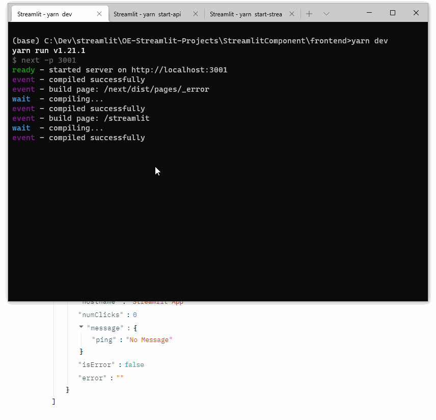

# Streamlit Component with Server API Interaction

> Arvindra Sehmi, Oxford Economics Ltd. | [Website](https://www.oxfordeconomics.com/) | [LinkedIn](https://www.linkedin.com/in/asehmi/)

## Application structure

There are three parts:

1. __Streamlit component host app__ (localhost, port 4009)
2. __Next.js (React) component__ (localhost, port 3001)
3. __Flask server hosting API endpoint__ (localhost, port 8888)

### Streamlit component host app

This uses a design similar to @synode's which generalises its ability to receive `OnStatusUpdate` and `OnError` _events_ from the hosted component, including an example of handling a "delegated host action" `OnActionRequest` event. The example provided of handling `OnActionRequest` is one where the component requests the host to make a web request, which then _passes_ the results back to the component. The latter is a bit hacky because the host app can communicate only _once_ with the hosted component, each time your script runs. To get around this I use a [SessionState](https://gist.github.com/FranzDiebold/898396a6be785d9b5ca6f3706ef9b0bc) implementation and the experimental `rerun` Streamlit API.

The _hack_ was implemented to get around a current security restriction of Streamlit components which don't allow the `allow-same-origin` CORS settings to be set (in fact it is `null`, which isn't the case for iframes). This makes it tricky calling protected APIs from a component if that endpoint is on a different origin domain, and doesn't want to allow `null` as its origin in the response! (Note, CORS needs to be configured properly along the entire call chain for a response to be returned to the component and subsequnetly its host.)

So, whilst I was able to get this _hack_ to work, it is far from ideal. Turns out the combination of `rerun` and updating the component properties from `SessionState` values is one time step behind the data that the host gets from its delegated API call (I have a timestamp on the API response and display the same in the component, so I can verify this). This aliasing anomally may be okay in some scenarios where CORS restrictions must be catered to. However, re-running the script is not fast, so YMMV.

## Next.js (React) component

This [Next.js](https://nextjs.org/) app is based on the [with-typescript](https://github.com/vercel/next.js/tree/canary/examples/with-typescript) example. Read the `Next.js` docs as they're very good, and this framework is a godsend after trying to use `React` competently and my battles with Babel!

The component implementaion is in `/pages/streamlit` and similar to the one described in `Streamlit Component-template`, reference 2, with some extras motivated by the `ReactPlayer integration` in reference 3.

Refer to the [frontend README.md](./frontend/README.md) for details on running a `Typescript` `Next.js` application.

The component UI displays its state, and provides three button actions to update the state: incrementing a click counter, invoking the API endpoint directly, and invoking the API by delegating the reponsibility to the host using `OnActionRequest` event. In the latter case, when the component is next updated from the host, it will receive the delegated API response data and updates its state, which will be displayed.

To run the frontend homepage, go to [http://localhost:3001](http://localhost:3001).

## Flask server hosting API endpoint

The Flask server provides a simple api endpoint on `/api/ping`. This returns a timestamped json object. To deal with the CORS issues discussed earlier, an `@app.after_request` decorator adds the necessary response headers to allow the repsonse to propagate into the React component which, in turn, updates its state and passes it to the Streamlit host through an `OnStatusUpdate` event. The Streamlit app reports the event data.

## Start the application

Whilst all three applications can be started individually in their own directory folders, you can simply enter the `/frontend` folder at the commnand line and run in separate terminals `yarn <command>`, where `<command>` is one of `dev`, `start-api`, or `start-streamlit`. Ideally, run the commands in this order.

This is the `scripts` section in `frontend/package.json`. With the `concurrently` package you could start them simultaneously from one command.

```json
"scripts": {
  "dev": "next -p 3001",
  "start": "next start -p 3001",
  "start-api": "python ../server/flask-api.py 8888",
  "start-streamlit": "streamlit run --server.port 4009 ../StreamlitComponent.py"
}
```
## Demo



## Key references

1. [Components API reference](https://docs.streamlit.io/en/stable/develop_streamlit_components.html#components-api-reference)
2. [Streamlit Component-template GitHub repo](https://github.com/streamlit/component-template)
3. A handy post by [@synode](https://discuss.streamlit.io/u/synode) on [integrating ReactPlayer as a component](https://discuss.streamlit.io/t/react-player-wip/3169)
4. My discussion with [@tim](https://discuss.streamlit.io/u/tim) on [Communicating with a React Component from Streamlit AFTER the component has been created](https://discuss.streamlit.io/t/communicating-with-a-react-component-from-streamlit-after-the-component-has-been-created/7239)

Enjoy!
